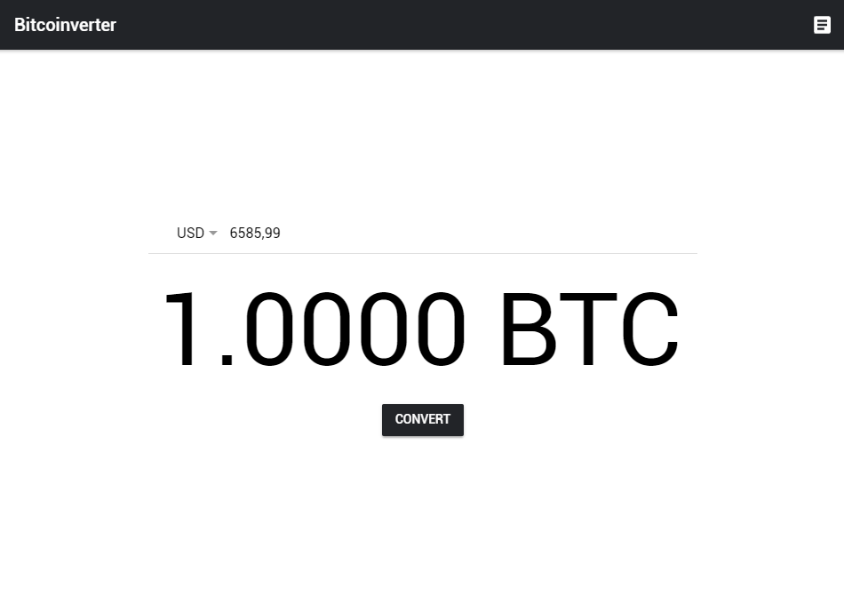
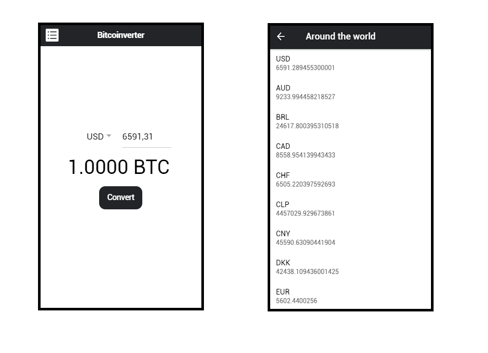

# Bitcoinverter

A Progressive Web App made with Ionic Core 4.0.0.
  
The Bitcoinverter uses the Blockchain Query API: https://blockchain.info/ticker for get current bitcoin values in other currencies around the world.

## Built With

* [Ionic Core](https://github.com/ionic-team/ionic/tree/master/core) - Web Components Package
* [Blockchain API](https://www.blockchain.com/api/) - Bitcoin Developer APIs

## Screenshots

## Authors

* **Mario Matheus** - [MarioMatheus](https://github.com/MarioMatheus/)

## License

The project is licensed by the MIT License - see [LICENSE.md](LICENSE) for more details.
